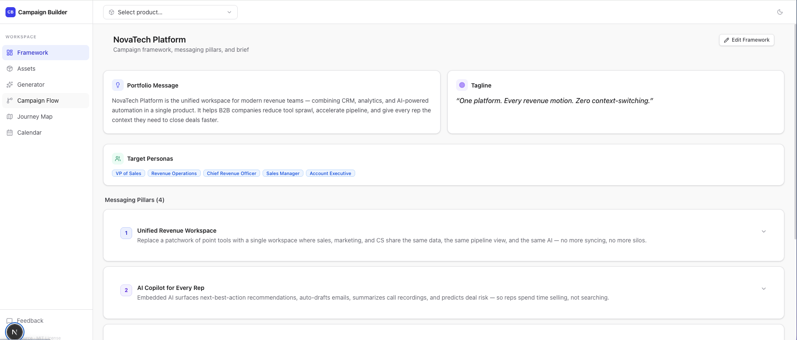
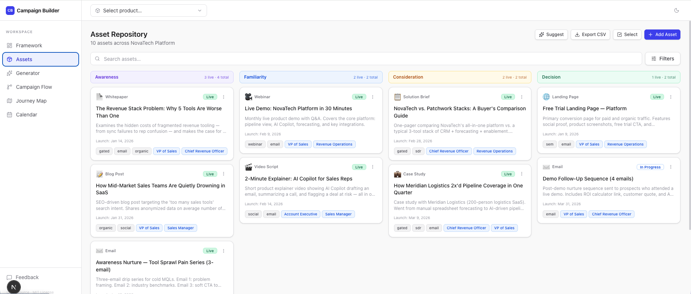
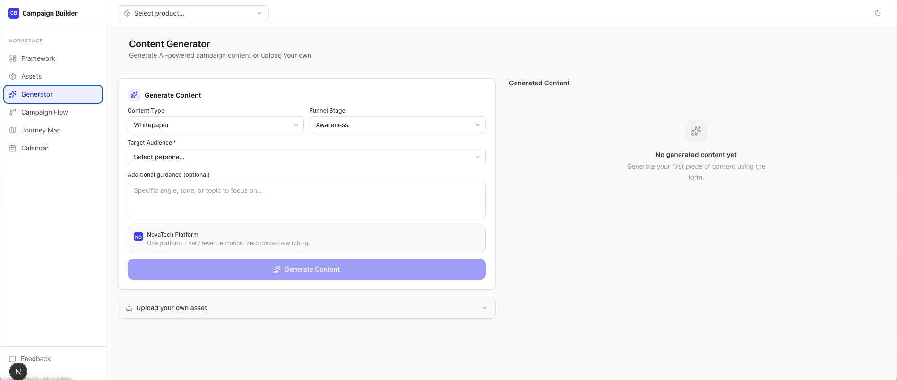
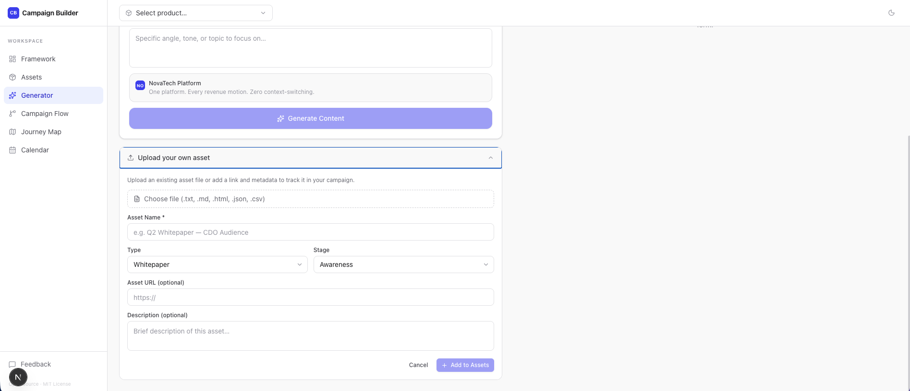
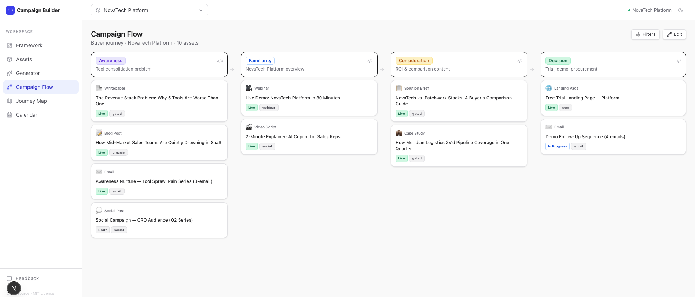
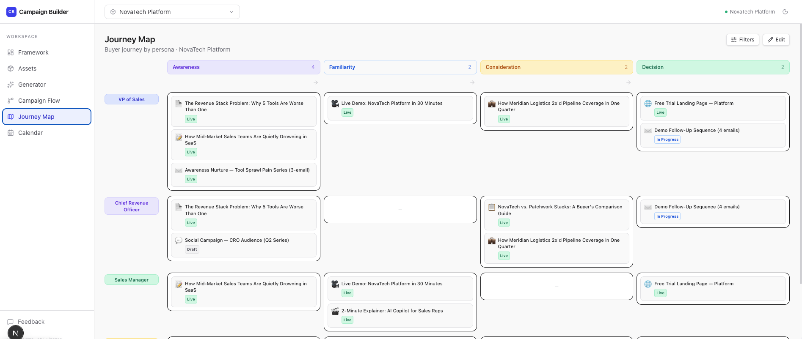
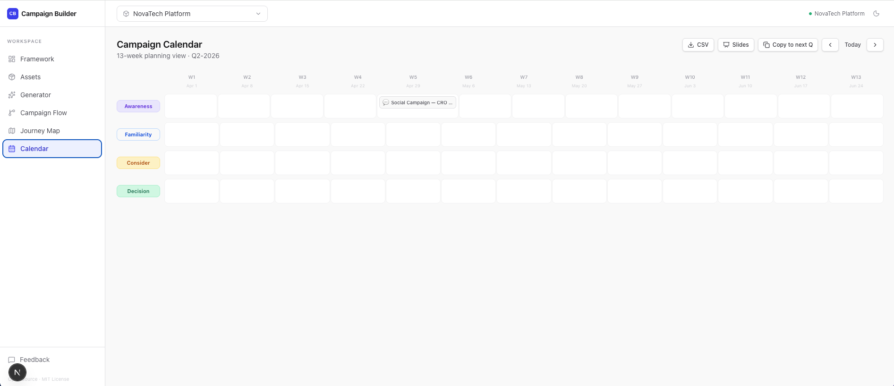
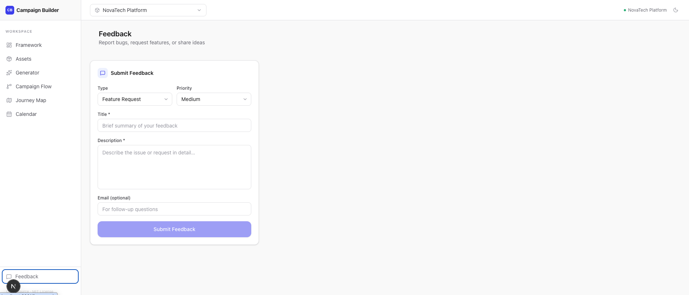
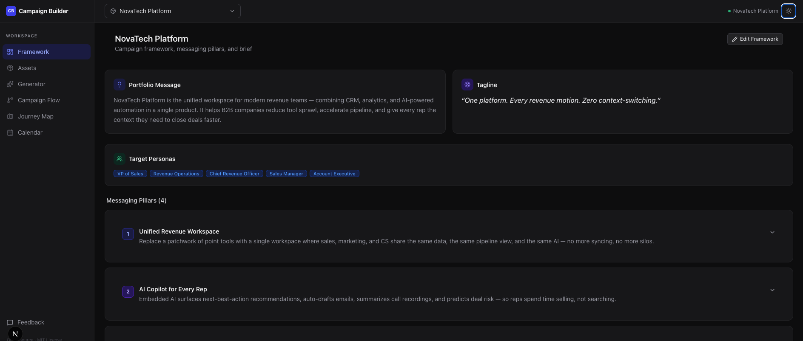

# Campaign Builder

An open-source campaign planning workspace for product marketing teams. Built with Next.js 16, TypeScript, Tailwind CSS v4, and Claude.

> Ships with two fictional demo products — **NovaTech Platform** and **NovaTech Analytics** — so you can explore every feature immediately with no setup.



---

## Features

### Framework
Document your product positioning in one place — messaging pillars, capabilities, personas, tagline, and a full campaign brief with quarterly themes.


### Asset Repository
Track every campaign asset with stage (awareness → decision), status, channels, personas, regions, and launch dates. Bulk-update status, export to CSV, and get AI suggestions for coverage gaps.



### Content Generator
Generate full campaign content grounded in your framework's positioning. Or upload your own files to add assets manually — no AI key required.





### Campaign Flow
Visualize assets across the buyer journey in a four-column funnel view. Edit mode lets you reorder assets up/down within each stage and edit any asset in place.



### Journey Map
Swimlane view organized by persona — spot coverage gaps at a glance. Edit mode with pencil overlays on every asset chip. Mobile-friendly with horizontal scroll.



### Calendar
13-week quarter grid showing scheduled launches by funnel stage. Export to CSV or printable HTML slides. Copy an entire quarter forward as drafts. Mobile shows a clean launch list.



### Feedback
Collect and track campaign feedback alongside your assets — keep stakeholder input in context, not buried in email.



### Dark Mode
Full dark mode support across every view — toggle in the top-right corner.



---

## Quick start

```bash
git clone https://github.com/desireem-seb/babel-system.git
cd babel-system/campaign-builder-next
npm install
npm run dev
```

Open [http://localhost:3000](http://localhost:3000). No database or API key required — demo data loads automatically.

---

## AI content generation

The Generator uses Claude to write full campaign assets grounded in your framework's positioning and personas. Add your API key to enable it:

```bash
# .env.local
ANTHROPIC_API_KEY=sk-ant-...
```

Without a key, all other features (assets, flow, journey, calendar, feedback) work fully.

---

## Data storage

**Local dev (default):** Changes write to JSON files in `/data/`. No setup needed.

**Production:** Set `DATABASE_URL` to a PostgreSQL connection string. The app auto-migrates tables on startup.

```bash
# Heroku example
heroku config:set DATABASE_URL=postgres://...
heroku config:set ANTHROPIC_API_KEY=sk-ant-...
git push heroku main
```

---

## Customizing for your team

1. **Replace demo data** — edit `data/campaign-frameworks.json` and `data/campaigns/<product>.json`
2. **Add a product** — add a new entry in `campaign-frameworks.json`, create `data/campaigns/<id>.json`
3. **Update branding** — logo and app name live in `src/components/layout/Sidebar.tsx` and `AppShell.tsx`

---

## Tech stack

| Layer | Choice |
|---|---|
| Framework | Next.js 16 App Router, `output: standalone` |
| Language | TypeScript (strict) |
| Styling | Tailwind CSS v4, class-based dark mode |
| State | Zustand + TanStack Query |
| AI | Anthropic Claude (`@anthropic-ai/sdk`) |
| Database | PostgreSQL via `pg` (optional, falls back to JSON) |
| Deploy | Heroku-ready (`Procfile` + `app.json`) |

---

## License

MIT
