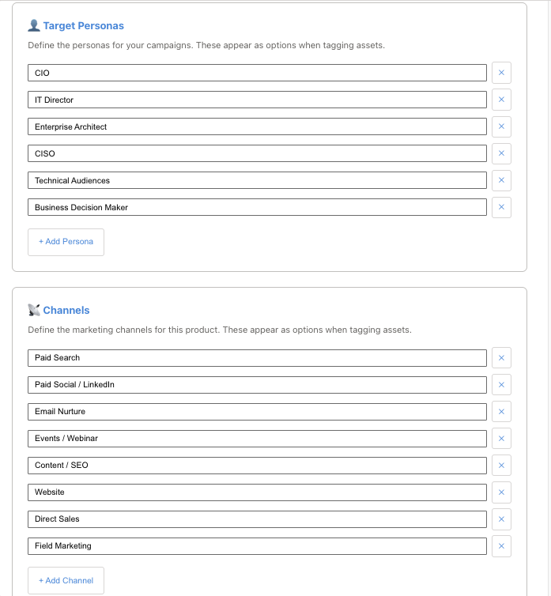
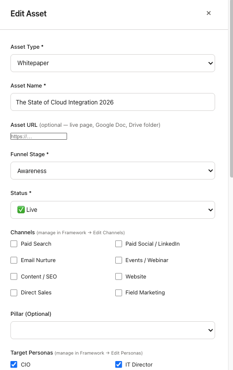
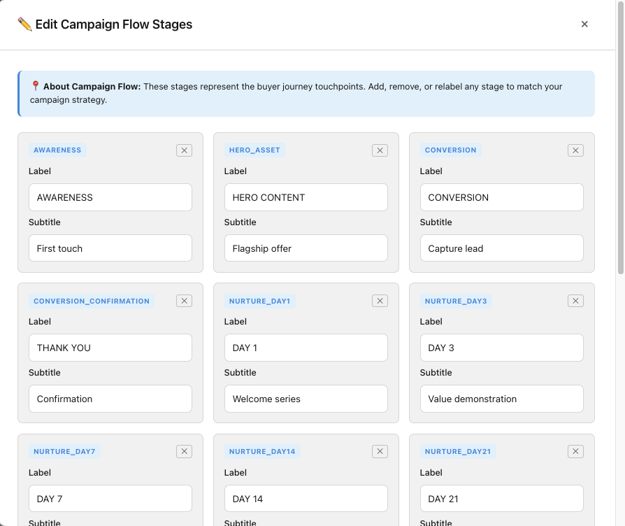
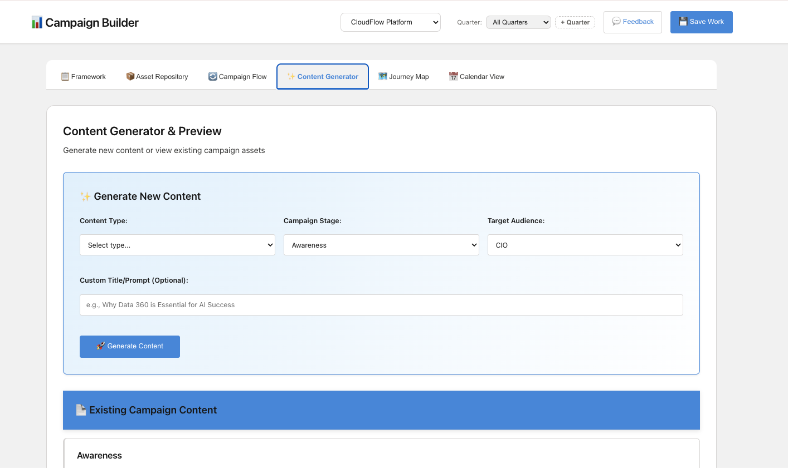
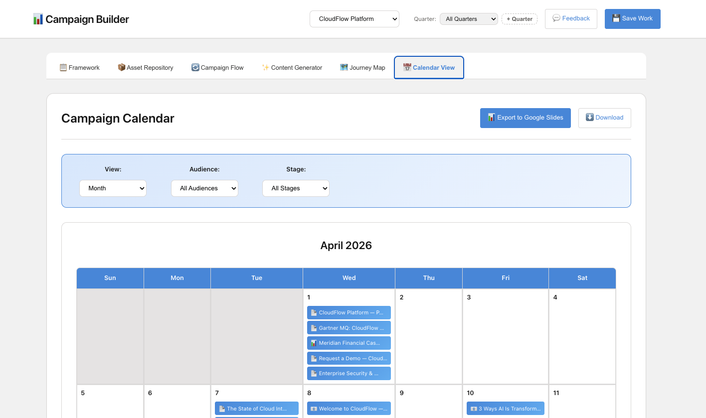
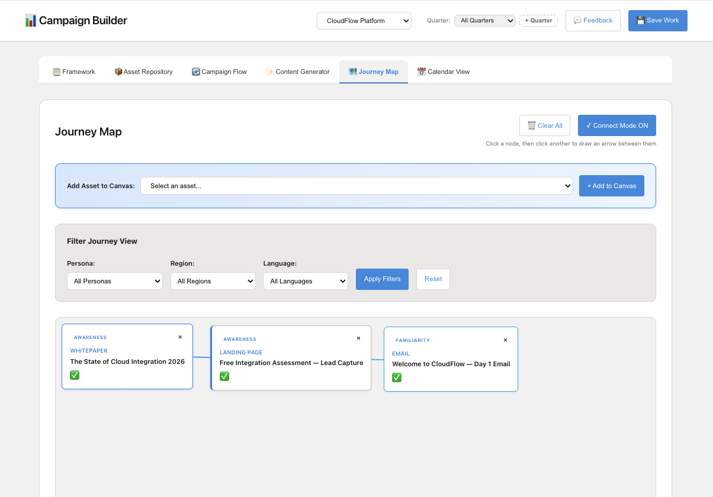
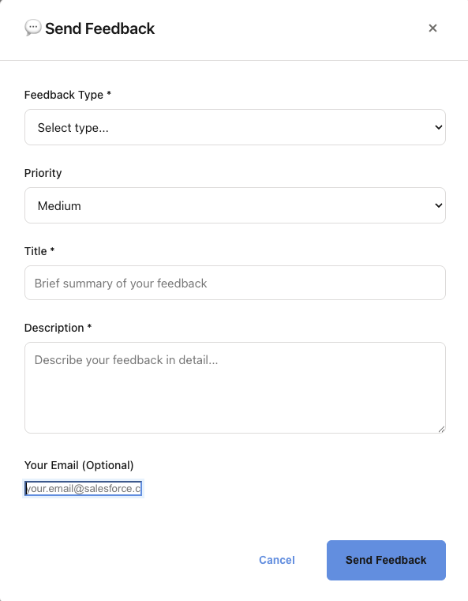

# Campaign Builder

[](LICENSE)
[](https://nodejs.org/)
[](CONTRIBUTING.md)

An open-source marketing campaign framework builder for creating structured campaign strategies, managing asset repositories, visualizing buyer journeys, and planning campaigns by quarter.

[Features](#-features) • [Screenshots](#-screenshots) • [Quick Start](#-quick-start) • [Customization](CUSTOMIZATION.md) • [Contributing](CONTRIBUTING.md) • [FAQ](docs/FAQ.md)

## 🎯 What It Does

Campaign Builder helps marketing teams:

1. **Define Campaign Frameworks** — Set portfolio messaging, taglines, 4 key pillars, and a campaign brief
2. **Manage Asset Repository** — Organize marketing assets by funnel stage with search, filtering, and CSV export
3. **Build Campaign Flows** — Create and customize buyer journey stages
4. **Generate Content with AI** — Use the built-in content generator (powered by Claude) to draft emails, blog posts, landing pages, and more
5. **Visual Journey Mapping** — Map how prospects move through your funnel
6. **Quarterly Campaign Planning** — Week-by-week grid view across all 4 funnel stages

## ✨ Features

- **Campaign Brief** — Document campaign objectives, key messages, and KPIs synced as context across all views
- **Framework Editor** — Edit messaging, tagline, pillars, and target personas; changes cascade to all tabs automatically
- **Persona Management** — Define target personas per product inside the app (no JSON editing required)
- **Campaign Flow Editor** — Add, remove, and customize buyer journey touchpoints
- **Asset Repository** — Organize assets by funnel stage with real-time search, status tracking, and one-click duplicate
- **Asset Tagging** — Tag by channel, persona, region, language, and more; filter any view by tag
- **Asset URL Field** — Link each asset directly to its live page, Google Doc, or Drive folder
- **Status Quick-Toggle** — Cycle asset status (Live → In Progress → Being Refreshed) without opening a modal
- **CSV Export** — Download your full asset list as a spreadsheet
- **AI Content Generator** — Generate campaign copy for 11 content types, grounded in your framework and brief
- **Visual Flow View** — See how assets connect through your campaign journey
- **Quarter Planning View** — Visual week-by-week grid (13 weeks × 4 funnel stages) with quarter navigation
- **Calendar Views** — Month, quarter, and year calendar with export to slides or CSV
- **Feedback System** — Built-in feedback collection and management dashboard
- **Data Persistence** — All data saved locally in JSON files

## 📸 Screenshots

### Home Screen
Choose from pre-loaded demo products or add your own. Setup instructions for personas, channels, and AI content generation are right on the page.


### Campaign Framework
View your portfolio message, tagline, and 4 strategic pillars with the campaign brief below.


### Framework Editor
Edit messaging, tagline, pillars, target personas, and marketing channels — all in one modal.



### Asset Repository
Search, filter, and manage marketing assets with colored tags, inline status toggle, and one-click duplicate.


### Edit Asset
Full asset editing with dynamic channel and persona checkboxes, URL field, funnel stage, and quarter assignment.



### Campaign Flow
Visualize how assets map through your buyer journey from awareness to decision.


### Edit Campaign Flow
Add, remove, and rename touchpoints to match your buyer journey.



### Content Generator
Generate AI-powered campaign copy for 11 content types, grounded in your framework and brief.



### Calendar View
Week-by-week quarter grid showing assets mapped across all 4 funnel stages.



### Journey Map
Drag assets onto the canvas and draw connections between touchpoints.



### Feedback System
Built-in feedback collection to gather input from your team.



## 🚀 Quick Start

### Prerequisites

- Node.js 18+ installed
- npm

### Installation

```bash
# Clone the repository
git clone https://github.com/desireem-seb/babel-system.git
cd campaign-builder

# Install dependencies
npm install

# (Optional) Set up your API key for AI content generation
cp .env.example .env
# Edit .env and add your ANTHROPIC_API_KEY

# Start the server
npm start
```

Open your browser to `http://localhost:4000`

### Setting Up AI Content Generation

The Content Generator tab uses the Anthropic API to write campaign copy. To enable it:

1. Get a free API key at [console.anthropic.com](https://console.anthropic.com)
2. Copy `.env.example` to `.env` in the project root
3. Add your key: `ANTHROPIC_API_KEY=sk-ant-...`
4. Restart the server: `npm start`

The rest of the app works without a key — only the Generate button requires it.

## 📁 Project Structure

```
campaign-builder/
├── server.js                    # Express server
├── .env.example                 # Environment variable template
├── public/
│   ├── index.html              # Main UI
│   ├── app.js                  # Frontend logic
│   ├── styles.css              # Styling
│   └── feedback-admin.html     # Feedback dashboard
├── data/
│   ├── campaign-frameworks.json # Your campaign frameworks + personas
│   ├── campaigns.json          # Campaign assets and journeys
│   └── feedback.json           # User feedback
└── package.json
```

## 🎨 Customization

### 1. Add Your Products

Edit `data/campaign-frameworks.json` to add your products:

```json
{
  "your-product": {
    "name": "Your Product Name",
    "portfolioMessage": "Your main value proposition",
    "tagline": "Your tagline",
    "pillars": [
      {
        "id": "pillar-1",
        "name": "Pillar 1 Name",
        "description": "What this pillar is about",
        "capabilities": ["Key capability 1", "Key capability 2"]
      }
    ]
  }
}
```

### 2. Set Up Your Personas

Personas are managed **inside the app** — no JSON editing required:

1. Select your product
2. Go to the **Framework** tab → click **✏️ Edit Framework**
3. Scroll to the **Target Personas** section
4. Add, edit, or remove personas to match your audience

Personas appear as tagging options on assets and as audience filters in the Content Generator.

### 3. Customize Branding

Edit `public/styles.css` to match your brand:

```css
:root {
  --primary: #4a90e2;       /* Your primary brand color */
  --primary-hover: #357ABD; /* Darker shade for hover */
  --primary-light: #E3F2FD; /* Light background tint */
  --secondary: #04844B;     /* Secondary / accent color */
}
```

### 4. Customize Flow Stages

1. Select a product → go to **Campaign Flow** tab
2. Click **✏️ Edit Campaign Flow**
3. Add, remove, or rename touchpoints to match your buyer journey

See [CUSTOMIZATION.md](CUSTOMIZATION.md) for full details.

## 🌐 Deployment

### Deploy to Heroku

```bash
heroku login
heroku create your-campaign-builder
heroku config:set ANTHROPIC_API_KEY=sk-ant-...
git push heroku main
heroku open
```

### Deploy to Your Own Server

```bash
npm install
export PORT=4000
export ANTHROPIC_API_KEY=sk-ant-...
npm start
```

## 📊 Using the Campaign Builder

### 1. Create Your Framework

1. Select or add your product
2. Click **✏️ Edit Framework** on the Framework tab
3. Fill in portfolio message, tagline, pillars, and personas
4. Save

### 2. Add Campaign Assets

1. Go to **Asset Repository** → click **+ Add Asset**
2. Fill in type, name, funnel stage, status, channels, personas, and optional URL
3. Save — the asset appears immediately in the repository and Campaign Flow

### 3. Generate Content

1. Go to **Content Generator**
2. Select content type, funnel stage, and audience
3. Add an optional title or context hint
4. Click **Generate** — the result is saved to your Asset Repository automatically

### 4. Plan by Quarter

1. Use the **Quarter** dropdown to filter all views by quarter
2. Click **+ Quarter** to add a new planning quarter
3. Switch to **Calendar View** for a week-by-week timeline

## 🔧 Configuration

| Variable | Default | Description |
|---|---|---|
| `PORT` | `4000` | Server port |
| `ANTHROPIC_API_KEY` | — | Required for AI content generation |

## 🤝 Contributing

We welcome contributions! Bug reports, feature requests, documentation improvements, and pull requests are all appreciated.

Read our [Contributing Guide](CONTRIBUTING.md) to get started. This project follows a [Code of Conduct](CODE_OF_CONDUCT.md).

## 📝 License

MIT License — free to use for your own projects.

## 🙋 Support

- Open an issue on GitHub
- Review the [FAQ](docs/FAQ.md) for common questions

## 🎓 Example Use Cases

- **B2B SaaS Marketing** — Plan product launch campaigns with full funnel coverage
- **Agency Work** — Manage multiple client campaigns in one place
- **Product Marketing** — Organize GTM strategies and persona-specific messaging
- **Content Marketing** — Plan and generate content journeys
- **Demand Gen** — Map lead nurture flows and track asset status

---

Built with ❤️ for marketers by marketers.

Want to share how you're using Campaign Builder? Open a discussion on GitHub!
