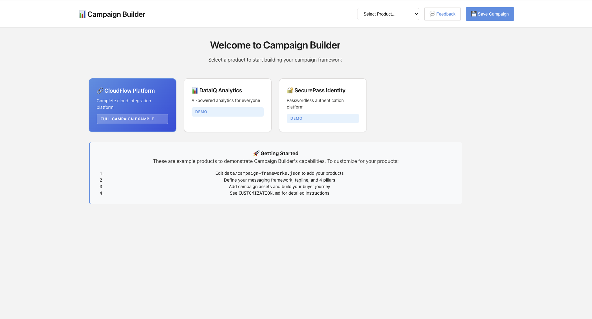
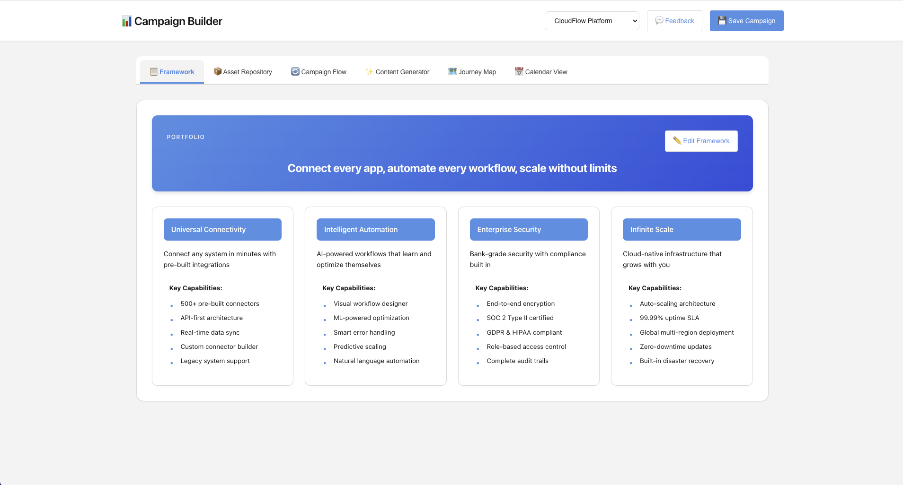
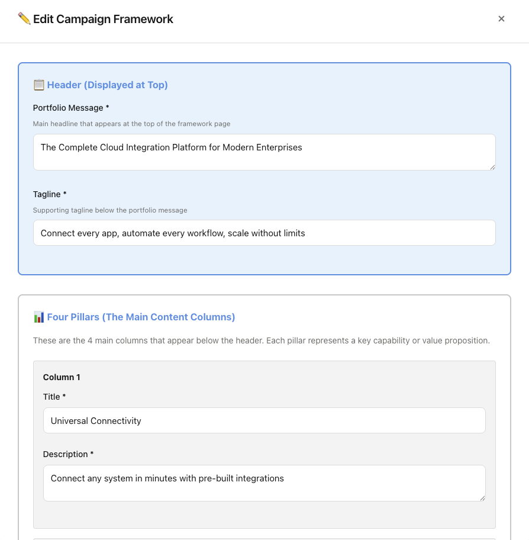
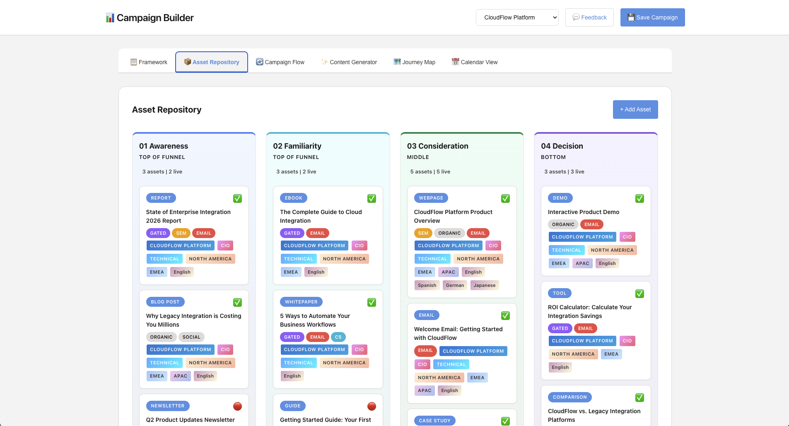
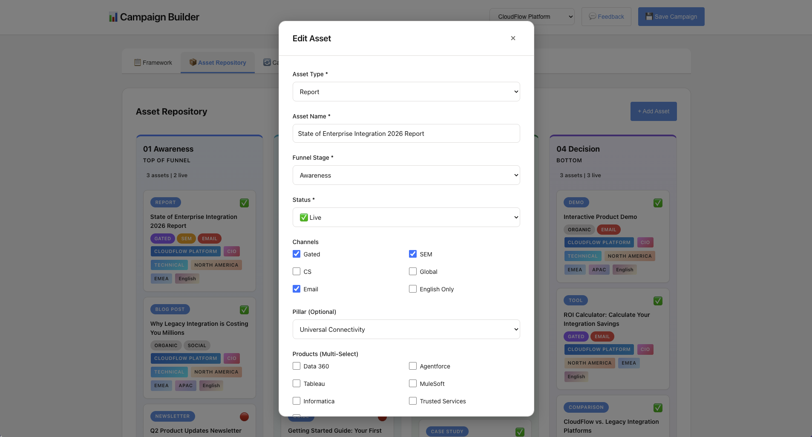
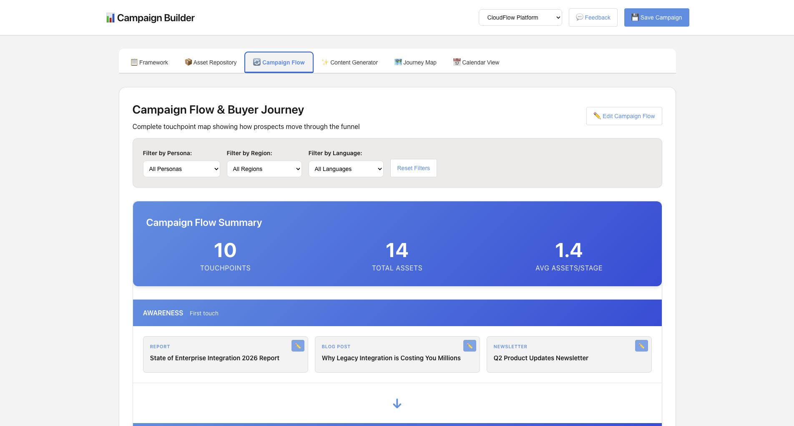
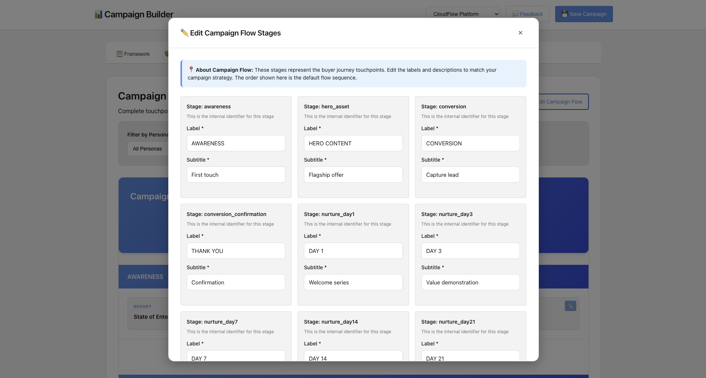

# Campaign Builder

[](LICENSE)
[](https://nodejs.org/)
[](CONTRIBUTING.md)

An open-source marketing campaign framework builder for creating structured campaign strategies, managing asset repositories, and visualizing buyer journeys.

[Features](#-features) • [Screenshots](#-screenshots) • [Quick Start](#-quick-start) • [Customization](CUSTOMIZATION.md) • [Contributing](CONTRIBUTING.md) • [FAQ](docs/FAQ.md)

## 🎯 What It Does

Campaign Builder helps marketing teams:

1. **Define Campaign Frameworks** - Set portfolio messaging, taglines, and 4 key pillars
2. **Manage Asset Repository** - Organize marketing assets by funnel stage (Awareness, Familiarity, Consideration, Decision)
3. **Build Campaign Flows** - Create and customize buyer journey stages
4. **Visual Journey Mapping** - Map how prospects move through your funnel
5. **Collect Feedback** - Built-in feedback system for team collaboration

## ✨ Features

- **Framework Editor**: Edit your messaging framework, tagline, and campaign pillars
- **Campaign Flow Editor**: Customize your buyer journey stages and touchpoints
- **Asset Repository**: Organize assets by funnel stage with status tracking (Live, In Progress, Being Refreshed)
- **Multi-dimensional Tagging**: Tag assets by channel, persona, region, language, and more
- **Visual Flow View**: See how assets connect through your campaign
- **Feedback System**: Built-in feedback collection and management
- **Data Persistence**: All data saved locally in JSON files
- **Responsive Design**: Works on desktop, tablet, and mobile

## 📸 Screenshots

### Home Screen
Choose from pre-loaded demo products or add your own.



### Campaign Framework
View your portfolio message, tagline, and 4 strategic pillars.



### Framework Editor
Edit your messaging, tagline, and all 4 pillars with an intuitive modal interface.



### Asset Repository
Organize marketing assets by funnel stage with status tracking and filtering.



### Asset Details
Edit any asset with detailed fields for type, channels, personas, regions, and more.



### Campaign Flow
Visualize how assets flow through your buyer journey from awareness to decision.



### Flow Editor
Customize each stage of your buyer journey with editable labels and descriptions.



### Feedback System
Built-in feedback collection to gather input from your team.


## 🚀 Quick Start

### Prerequisites

- Node.js 18+ installed
- npm or yarn

### Installation

```bash
# Clone the repository
git clone https://github.com/desireem-seb/babel-system.git
cd campaign-builder

# Install dependencies
npm install

# Start the server
npm start
```

Open your browser to `http://localhost:4000`

## 📁 Project Structure

```
campaign-builder/
├── server.js                    # Express server
├── public/
│   ├── index.html              # Main UI
│   ├── app.js                  # Frontend logic
│   ├── styles.css              # Styling
│   └── feedback-admin.html     # Feedback dashboard
├── data/
│   ├── campaign-frameworks.json # Your campaign frameworks
│   ├── campaigns.json          # Campaign assets and journeys
│   └── feedback.json           # User feedback
└── package.json
```

## 🎨 Customization

### 1. Add Your Products

Edit `data/campaign-frameworks.json` to add your products:

```json
{
  "your-product": {
    "name": "Your Product Name",
    "portfolioMessage": "Your main value proposition",
    "tagline": "Your tagline",
    "pillars": [
      {
        "id": "pillar-1",
        "name": "Pillar 1 Name",
        "description": "What this pillar is about",
        "capabilities": [
          "Key capability 1",
          "Key capability 2"
        ]
      }
      // Add 3 more pillars
    ]
  }
}
```

### 2. Customize Branding

Edit `public/styles.css` to match your brand:

```css
:root {
  /* Change these colors to match your brand */
  --primary: #4a90e2;           /* Your primary brand color */
  --primary-hover: #357ABD;     /* Darker shade for hover */
  --primary-light: #E3F2FD;     /* Light background */
  --secondary: #04844B;         /* Secondary color */
}
```

### 3. Customize Flow Stages

The default buyer journey stages can be customized through the UI:
1. Select a product
2. Go to "Campaign Flow" tab
3. Click "✏️ Edit Campaign Flow"
4. Modify stage labels and descriptions

## 🌐 Deployment

### Deploy to Heroku

```bash
# Login to Heroku
heroku login

# Create a new Heroku app
heroku create your-campaign-builder

# Deploy
git push heroku main

# Open your app
heroku open
```

### Deploy to Vercel

1. Install Vercel CLI: `npm install -g vercel`
2. Run `vercel` in the project directory
3. Follow the prompts

### Deploy to Your Own Server

1. Copy files to your server
2. Install dependencies: `npm install`
3. Set PORT environment variable: `export PORT=4000`
4. Start with PM2 or similar: `pm2 start server.js`

## 📊 Using the Campaign Builder

### 1. Create Your Framework

1. Select or add your product
2. Click "✏️ Edit Framework" on the Framework tab
3. Fill in your portfolio message, tagline, and 4 pillars
4. Save

### 2. Add Campaign Assets

1. Go to "Asset Repository" tab
2. Click "+ Add Asset"
3. Fill in asset details:
   - Type (Blog, Whitepaper, Webinar, etc.)
   - Name
   - Funnel stage
   - Status
   - Channels, personas, regions
4. Save

### 3. Customize Campaign Flow

1. Go to "Campaign Flow" tab
2. Click "✏️ Edit Campaign Flow"
3. Modify stage labels and subtitles to match your strategy
4. Save

### 4. View Your Campaign Flow

The Campaign Flow tab shows:
- All your assets organized by journey stage
- Asset details (type, name, status)
- Filter by persona, region, or language
- Click any asset to edit it

## 🔧 Configuration

### Port Configuration

Default port is 4000. To change:

```bash
export PORT=3000
npm start
```

Or in your code:
```javascript
const PORT = process.env.PORT || 4000;
```

### Data Storage

All data is stored in the `data/` directory:
- `campaign-frameworks.json` - Product frameworks
- `campaigns.json` - Campaign assets and data
- `feedback.json` - User feedback

These files are created automatically on first run.

## 🤝 Contributing

We welcome contributions from everyone! Whether you're fixing a bug, adding a feature, or improving documentation, your help makes Campaign Builder better.

**Ways to contribute:**
- 🐛 Report bugs
- 💡 Suggest new features  
- 📝 Improve documentation
- 🔧 Submit pull requests
- ⭐ Star the repo to show your support

**Read our [Contributing Guide](CONTRIBUTING.md) to get started!**

This project follows a [Code of Conduct](CODE_OF_CONDUCT.md). By participating, you agree to uphold this code.

## 📝 License

MIT License - feel free to use this for your own projects!

## 🙋 Support

- Open an issue on GitHub
- Check existing issues for common problems
- Review the documentation above

## 🎓 Example Use Cases

- **B2B SaaS Marketing**: Plan product launch campaigns
- **Agency Work**: Manage multiple client campaigns
- **Product Marketing**: Organize GTM strategies
- **Content Marketing**: Plan content journeys
- **Demand Gen**: Map lead nurture flows

## 🔗 Related Tools

This tool pairs well with:
- Google Analytics (track campaign performance)
- HubSpot/Marketo (execute campaigns)
- Figma (design assets)
- Airtable (extended project management)

## 📈 Roadmap

Planned features:
- [ ] Export campaigns to PDF/PowerPoint
- [ ] Analytics dashboard
- [ ] Team collaboration features
- [ ] Asset upload and storage
- [ ] Template library
- [ ] Calendar view for scheduled assets

---

Built with ❤️ for marketers by marketers.

Want to share how you're using Campaign Builder? Open a discussion on GitHub!
